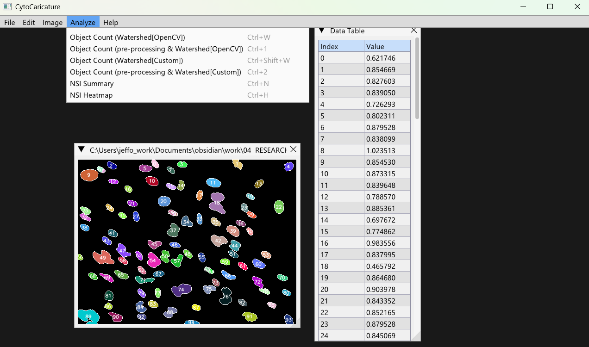

[ counting
- NSI (Nuclear Shape Index) analysis and heatmap generation

#### Platforms
- GUI and CLI support (see releases for details)

## 📦 Get Started

Download the latest binaries and see release notes in the [Releases](https://github.com/jeffock/cyto_caricature/releases) section. Each release includes a summary of new features and changes.

> **Note:** The project is under active development. The codebase is evolving and may not be fully stable.

## 🖥️ Screenshots & Demos

## 📚 Documentation

- Documentation is a work in progress.
- For updates and guides, check back soon or follow the project for notifications.

## 🛠️ Dependencies

| Library     | Version         |
|-------------|----------------|
| glad        | v0.1.36        |
| glfw3       | v3.4#1         |
| imgui       | v1.91.9        |
| opencv      | v5.29.3        |

## 💻 System Support

| Platform      | Supported |
|---------------|-----------|
| Windows x64   | ✅        |
| Windows x86   | ❌        |
| Linux x86_64  | ❌        |
| Linux i386    | ❌        |
| macOS x86     | ❌        |
| macOS x86_64  | ❌        |

## 📄 License

*GNU General Public License Version 3*

## 📬 Contact

For questions, feedback, or collaboration, feel free to reach out via GitHub Issues.

*Thank you for checking out CytoCaricature! If you find this project useful, please consider starring or sharing it.*

[1] https://img.shields.io/badge/version-2.0.1-green.svg
[2] https://github.com/jeffock/cyto_caricature/releases
[3] https://img.shields.io/badge/documentation-WIP-orange.svg